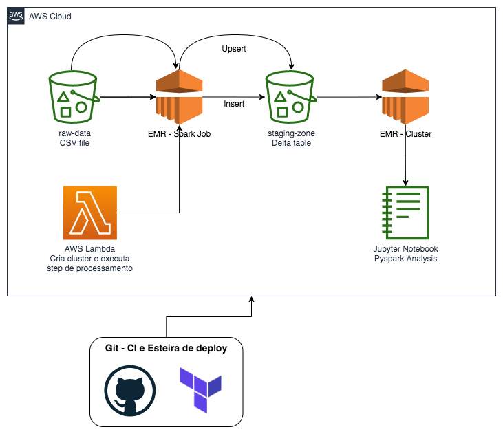

## Delta Lake with EMR

This project was inspired by graduate classes in data engineering. Great part of the material was built using the Rony package and Professor Neylson Crepalde's class codes.

The project structure follows a simple flow of data processing based on the Lambda function, an AWS serveless resource. The entire deployment mat was done with CI/CD on github. To build the project on your machine, pay attention to the details below.

Solution Architecture:

0) Create all the secrets to your gihtub repository.
1) Create a key-pair in EC2.
2) Dont forget to change your account ID inside policy ARN!
3) You must have at least one bucket with your raw data to process.
4) Create pull request on dev branch in order to test all structures in CI/CD
5) Verify at github actions if everything is ok.
6) Check at AWS if all structures and products were created.
7) Run terraform init
8) Run touch lambda_function_payload.zip
9) Run terraform destroy (it wont destroy s3 bucket that is not empty)